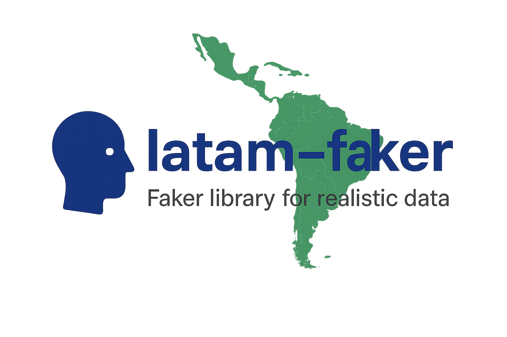

[](https://www.npmjs.com/package/latam-faker)
[](https://github.com/mat1asAlfaro/latamfaker/actions)
[](./LICENSE)

**LatAm Faker** is an open-source JavaScript/TypeScript library for generating realistic fake data with a focus on Latin American countries.  
It is designed to make testing, prototyping, demos, and seeding databases easier by providing culturally accurate data (names, IDs, addresses, phone numbers, etc.) specific to the region.

Unlike other faker libraries that focus mainly on global or US/European data, **LatAm Faker** emphasizes **locales for Latin America**, making it especially useful for projects targeting these markets.

---

## 🚀 Features

- Written in **TypeScript** with type definitions included.
- Fully compatible with **Node.js** and modern bundlers (Vite, Webpack, etc.).
- Deterministic output with `seed`, ensuring reproducibility in tests.
- Supports multiple categories of fake data:
  - 👤 People (names, surnames, national IDs, birth dates, etc.)
  - 🏠 Addresses (street names, postal codes, cities)
  - 📞 Phones (mobile and landlines with local formats)
  - 🏢 Companies & commerce (business names, CUIT/RUC, etc.)
  - 💳 Finance (bank accounts, credit cards)
  - 🌐 Internet (emails, IPs, domains, usernames)
  - 🚗 Vehicles (brands, license plates)
  - 📝 Placeholder text (lorem ipsum with Spanish flavor)

---

## 🌎 Supported Locales

- Argentina (`ar`)
- Chile (`cl`)
- Mexico (`mx`)
- Peru (`pe`)
- Colombia (`co`)
- Uruguay (`uy`)

---

## ⚙️ Installation

You can install it with your preferred package manager:

```bash
pnpm add latam-faker
# or with npm
npm install latam-faker
# or with yarn
yarn add latam-faker
```
